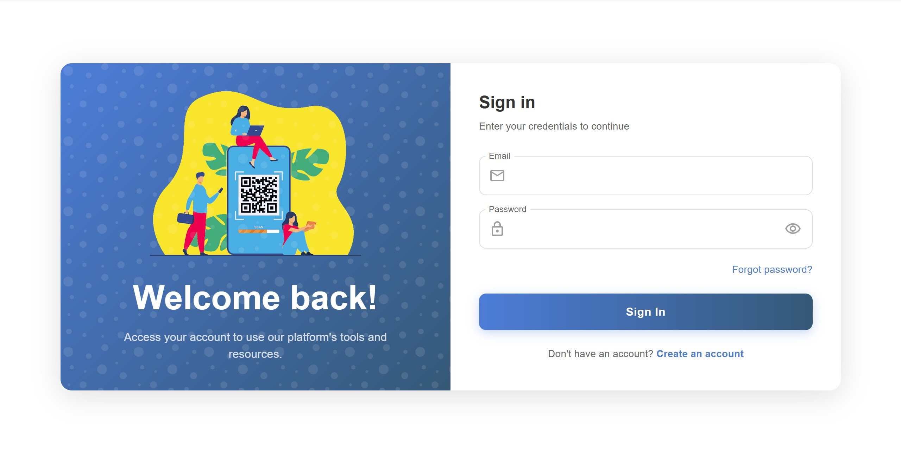

# QR Generator Fullstack

A full-stack web application for generating and managing QR codes with customizable features including text, colors, and logos.

### Login page



### Homepage


## 🚀 Features

- **QR Code Generation**: Create QR codes with custom text content
- **Customization Options**: 
  - Custom colors
  - Logo integration
  - Various styling options
- **QR Code History**: Track and manage previously generated QR codes
- **Download Functionality**: Save QR codes in various formats
- **Responsive Design**: Works seamlessly on desktop and mobile devices

## 🛠️ Tech Stack

### Frontend
- **React 19** - UI library
- **Vite** - Build tool and development server
- **Material-UI (MUI)** - Component library
- **Axios** - HTTP client
- **qr-code-styling** - QR code generation and styling
- **React Hook Form** - Form management

### Backend
- **Python** - Server-side language
- **FastAPI** (assumed based on structure) - Backend framework
- **SQLite/PostgreSQL** (assumed) - Database

## 📁 Project Structure

```
├── frontend/                 # React frontend application
│   ├── src/
│   │   ├── components/      # Reusable UI components
│   │   ├── pages/          # Page components
│   │   ├── api/            # API service functions
│   │   ├── hooks/          # Custom React hooks
│   │   ├── services/       # Business logic services
│   │   └── utils/          # Utility functions
│   ├── package.json
│   └── vite.config.js
├── backend/                 # Python backend application
│   ├── app/
│   │   ├── api/            # API endpoints
│   │   ├── core/           # Core application logic
│   │   ├── db/             # Database configuration
│   │   ├── models/         # Database models
│   │   ├── schemas/        # Pydantic schemas
│   │   └── services/       # Business logic services
│   ├── requirements.txt
│   └── run.sh
└── README.md
```

## 🚦 Getting Started

### Prerequisites

- **Node.js** (v18 or higher)
- **Python** (v3.8 or higher)
- **pip** (Python package manager)

### Installation

1. **Clone the repository**
   ```bash
   git clone <repository-url>
   cd Tools-Website
   ```

2. **Setup Backend**
   ```bash
   cd backend
   pip install -r requirements.txt
   ```

3. **Setup Frontend**
   ```bash
   cd frontend
   npm install
   ```

### Running the Application

1. **Start the Backend Server**
   ```bash
   cd backend
   chmod +x run.sh
   ./run.sh
   ```
   Or manually:
   ```bash
   python -m uvicorn app.main:app --reload
   ```

2. **Start the Frontend Development Server**
   ```bash
   cd frontend
   npm run dev
   ```

3. **Access the Application**
   - Frontend: `http://localhost:5173`
   - Backend API: `http://localhost:8000`

## 🔧 Configuration

### Frontend Configuration
Create a `.env` file in the `frontend/` directory:
```env
VITE_API_BASE_URL=http://localhost:8000
```

### Backend Configuration
Create a `.env` file in the `backend/` directory:
```env
DATABASE_URL=your_database_url
SECRET_KEY=your_secret_key
```

## 📝 Usage

1. **Generate QR Code**:
   - Navigate to the QR Generator page
   - Enter your text content
   - Customize colors and add logos if desired
   - Click "Generate" to create your QR code

2. **View History**:
   - Access the QR History page to view previously generated codes
   - Download or manage your QR codes

3. **Download QR Codes**:
   - Click the download button to save QR codes in various formats

## 📱 API Endpoints

- `GET /api/qr-history` - Retrieve QR code history
- `POST /api/qr-generate` - Generate new QR code
- `DELETE /api/qr/{id}` - Delete QR code
- `GET /api/qr/{id}/download` - Download QR code

## 🧪 Testing

### Frontend
```bash
cd frontend
npm run test
```

### Backend
```bash
cd backend
pytest
```

## 🚀 Deployment

### Frontend
```bash
cd frontend
npm run build
```

### Backend
```bash
cd backend
# Follow your deployment platform's instructions
```

## 🤝 Contributing

1. Fork the repository
2. Create a feature branch (`git checkout -b feature/amazing-feature`)
3. Commit your changes (`git commit -m 'Add some amazing feature'`)
4. Push to the branch (`git push origin feature/amazing-feature`)
5. Open a Pull Request

## 📄 License

This project is licensed under the MIT License - see the [LICENSE](LICENSE) file for details.

## 👨‍💻 Author

**Nhan Pham Thanh**

## 🙏 Acknowledgments

- Material-UI for the component library
- qr-code-styling for QR code generation capabilities
- React and Vite communities for excellent tooling